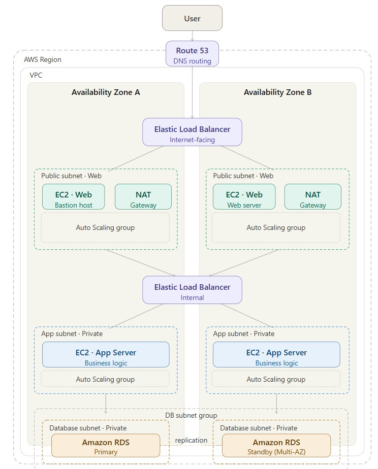

# 🚀 AWS 3-Tier Architecture using Terraform



This project provisions a **highly available and scalable 3-tier architecture on AWS using Terraform**.  
The infrastructure is designed using modular Terraform code and follows standard cloud architecture practices.

---

## 🧠 Architecture Overview

The system is divided into three layers:

* **Web Tier** – Handles incoming traffic  
* **Application Tier** – Processes backend logic  
* **Database Tier** – Stores application data  

The deployment spans across **multiple Availability Zones (Multi-AZ)** to ensure high availability and fault tolerance.

---

## 🌐 Architecture Flow

User → Route 53 → Public Load Balancer → Web Tier → Internal Load Balancer → Application Tier → RDS Database

---

## ⚙️ AWS Services Provisioned

* Amazon VPC (Public & Private Subnets)  
* Application Load Balancer (Public & Internal)  
* Amazon EC2 (Web & Application servers)  
* Auto Scaling Groups  
* Amazon RDS (Multi-AZ)  
* NAT Gateway  
* Route 53  
* ACM (SSL Certificates)  
* Security Groups  

---


## 📁 Project Structure

```
.
├── main.tf
├── README.md
├── 3_tier_architecture.jpg
├── .gitignore
├── modules/
│   ├── network/
│   ├── security/
│   ├── bastion/
│   ├── launch_templates/
│   ├── asg/
│   ├── load_balancers/
│   ├── rds/
│   ├── route53/
│   └── acm/
```

---


## ⚙️ Modules Overview

* **network** → VPC, subnets, route tables  
* **security** → Security groups and access rules  
* **bastion** → Bastion host for secure SSH access  
* **launch_templates** → EC2 launch templates  
* **asg** → Auto Scaling Groups for web and app tiers  
* **load_balancers** → Public and internal Application Load Balancers  
* **rds** → Multi-AZ database setup  
* **route53** → DNS configuration  
* **acm** → SSL certificate management  

---


## 🚀 Deployment Steps

1. Initialize Terraform

```
terraform init
```

2. Validate configuration

```
terraform validate
```

3. Plan infrastructure

```
terraform plan
```

4. Apply configuration

```
terraform apply
```

---


---

## 🔐 Security Design

* Public subnets for **Load Balancer, NAT Gateway, and Bastion host**  
* Web and Application tiers deployed across multiple subnets  
* Private subnets used for Application and Database layers  
* No direct internet access to backend resources  
* Security groups control communication between tiers  
* NAT Gateway enables secure outbound internet access  

---

## 📊 Key Features

* Multi-AZ deployment for high availability  
* Auto Scaling for dynamic workload handling  
* Internal and external load balancing  
* Modular Terraform structure  
* Secure network architecture  

---

## 📌 Notes

* Infrastructure is fully provisioned using Terraform  
* Follows standard AWS 3-tier architecture pattern  
* Modular design improves reusability and maintainability  

---
